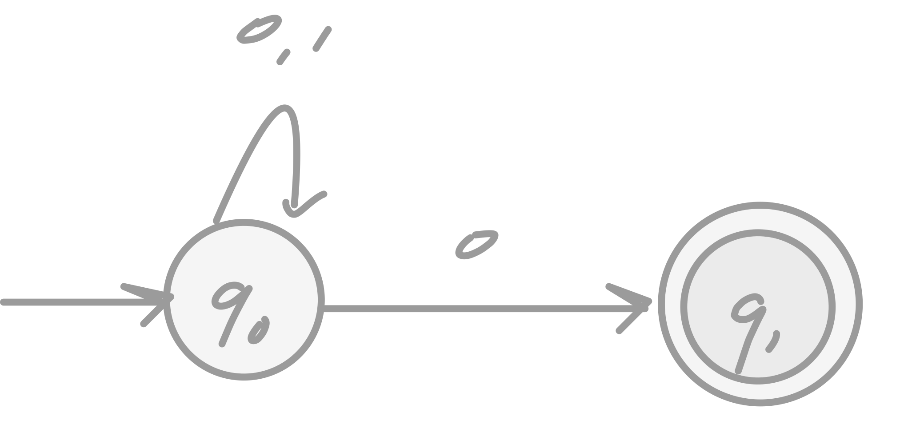
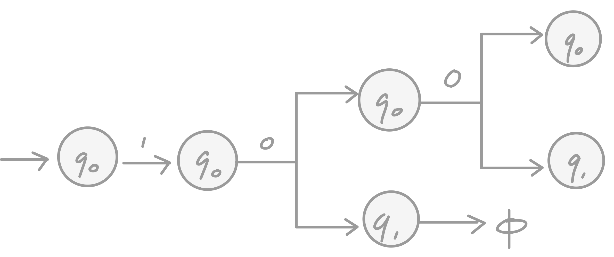
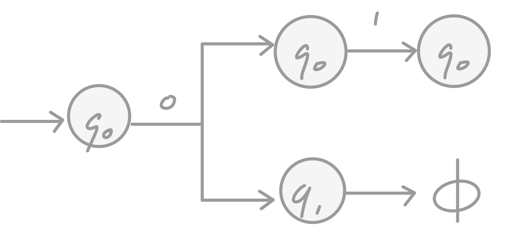
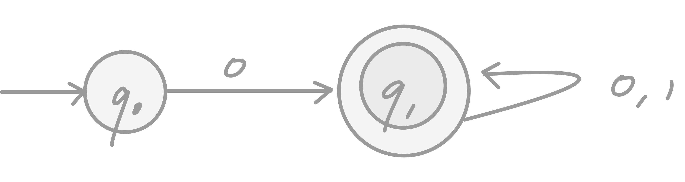
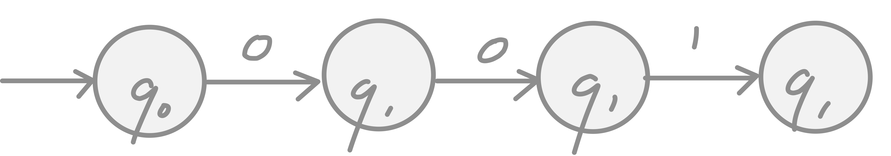
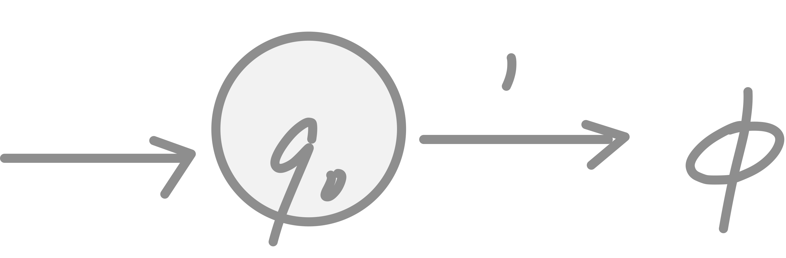
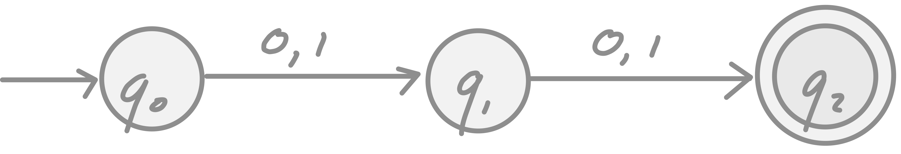
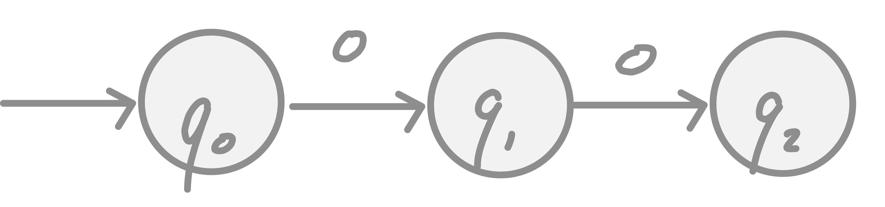
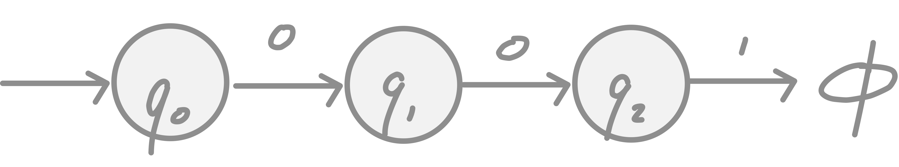

# finite automata

A finite automata has a set of states and its "control" moves from state to state in response to external "inputs".  One of the crucial distinctions among classes of finite automata is whether that control is "deterministic", meaning that the automaton cannot be in more than one state at one time, or "nondeterministic", meaning that it may be in several states simultaneously.

Adding nondeterminism does not let us define any language that cannot be defined by a deterministic finite automaton, but there can be a substantial efficiency in describing an application using a nondeterministic automaton.  Nondeterminism allows us to "program" solutions to problems using a higher-level language.  The nondeterministic finite automaton is then "compiled", by an algorithm we shall learn soon, into a deterministic automaton that can be "executed" on a conventional computer.

Extended nondeterministic automaton have the the additional choice of making a transition from one state to another spontaneously, i.e., on the empty string as "input".  These automata also accept nothing but the regular languages.  Regular languages are important to something called regular expression and are important in determining the equivalence to other automata.

The study of the regular languages will contain the algebraic notation known as regular expressions.  After discussing regular expressions, and showing their equivalence to finite automata, we will use both automata and regular expressions as tools to show certain properties of the regular languages.  These properties are the "closure" properties, which allow us to claim that one language is regular becasue one or other languages are known to be regular, and "decision" properties.  The latter are algorithms to answer questions about automata or regular expressions, e.g. whether two automata or expressions represent the same language.

## Deterministic Finite Automata

Let us present a formal notion of a deterministic finite automata.  The term deterministic refers to the fact that on each input there is one and only one state to which the automataton can transition from its current state.  In constrast, "nondeterministic" finite automata, can be in several states simultaneously.  The term "finite automataon" will refer to the deterministic variety, although we shall use "deterministic" or the abbreviation DFA normally, to remind the reader of which kind of automaton we are talking about.

A deterministic finite automaton is a quintuple $M = (Q, \Sigma, \delta, q_{0}, F)$ where

1.  A finite set of _states_ is denoted as $Q$.
2.  A finite set of _input symbols_ is denoted as $\Sigma$.
3.  A _transition function_ is denoted as $\delta$.
4.  A _start state_, denoted as $q_{0}$ is one of the states in $Q$.
5.  A set of _final_ or _accepting_ states $F$.  $$F \subseteq Q$$

$\delta$ takes arguments a state of an input symbol and returns a state.  $\delta(q, a)$ is the state that $M$ moves to when it is in state $q$ and reads input symbol $a$.  The transition function is defined for all pairs $(q, a)$ where $q \in Q$ and $a \in \Sigma$.

A deterministic finite automaton will often be referred to as a DFA.  The most succinct representation of a DFA is a listing of the five components above.  Known as having a five tuple notation:

$$M = (Q, \Sigma, \delta, q_{0}, F)$$

where $M$ is the name of the automaton, $Q$ is the set of states, $\Sigma$ is the set of input symbols, $\delta$ is the transition function, $q_{0}$ is the start state, and $F$ is the set of final states.

### how a DFA processes strings

The first thing we need to understand about a DFA is how the DFA decides whether or not to "accept" a sequence of input symbols.  The "language" of the DFA is the set of all strings that the DFA accepts.  Suppose $a_{1}, a_{2}, \dots , a_{n}$ is a sequence of input symbols.  We start out with the DFA in its start state, $q_{0}$.  We consult the transition function $\delta$, say $\delta(q_{0}, a_{1}) = q_{1}$ to find the state that the DFA _$A$_ enters after processing the first input symbol $a_{1}$.  We process the next input symbol, $a_{2}$ by evaulating $\delta(q_{1}, a_{2})$; let us suppose this state is $q_{2}$.  We continue in this manner, finding states $q_{3}, q_{4}, \dots , q_{n}$ such that $\delta(q_{i-1}, a_{i}) = q_{i}$ for each $i$.  

**If** $q_{n} \in F$, 

**then** the input $a_{1}a_{2} \dots a_{n}$ is accepted

**else** the input $a_{1}a_{2} \dots a_{n}$ is rejected

### example

Let us formally specify a DFA that accepts all and only the strings of 0's and 1's that have the sequence 01 somewhere in the string.  We can write this language $L$ as:

$$L ::= \{{w | \text{w is of the form x01y for some strings x and y consisting of 0's and 1's}}\}$$

Another equivalent description of $L$ is, using parameters $x$ and $y$ to the left of the vertical bar, is:

$$L ::= {x01y | x \text{ and } y \text{ are strings of 0's and 1's}}$$

We can now specify the DFA $M$ that accepts $L$:

$$M = (Q, \Sigma, \delta, q_{0}, F)$$

where $Q = \{q_{0}, q_{1}, q_{2}, q_{3}\}$, $\Sigma = \{0, 1\}$, $q_{0}$ is the start state, and $F = \{q_{3}\}$.  The transition function is defined as follows:

$$\delta(q_{0}, 0) = q_{0}$$
$$\delta(q_{0}, 1) = q_{1}$$
$$\delta(q_{1}, 0) = q_{2}$$
$$\delta(q_{1}, 1) = q_{1}$$
$$\delta(q_{2}, 0) = q_{2}$$
$$\delta(q_{2}, 1) = q_{2}$$
$$\delta(q_{3}, 0) = q_{3}$$
$$\delta(q_{3}, 1) = q_{3}$$

Therefore the complete specification of the automataon $M$ is:

$$M = (\{q_{0}, q_{1}, q_{2}, q_{3}\}, \{0, 1\}, \delta, q_{0}, \{q_{3}\})$$

where $\delta$ is defined as above.

### simpler notations for DFAs

Specifying a DFA as a five-tuple with a detailed description of the transition function is not very convenient.  We can use a more compact notation.  The transition function $\delta$ can be represented as a table.  The rows of the table are the states of the automaton, and the columns are the input symbols.  The entry in the row for state $q$ and the column for input symbol $a$ is the state $\delta(q, a)$.

1.  A _transition diagram_ is a graphical representation of a DFA.  The states are represented as circles, and the input symbols are represented as arrows.  The transition diagram for the DFA $M$ is shown below.  

2.  A _transition table_ is a tabular listing of the $\delta$ function.  Which by implication tells us the set of states and the input alphabet.

**Transition diagram for DFA $M$**

A transition diagram for the DFA $M$ is shown below.  The states are represented as circles, and the input symbols are represented as arrows.  The transition diagram for the DFA $M$ is shown below.

$$M = (Q, \Sigma, \delta, q_{0}, F)$$

a)  For each state in $Q$ there is a node

b)  For each state $q$ in $Q$ and each input symbol $a$ in $\Sigma$, let $\delta(q, a) = p$.  Then the transition diagram has an arc from node $q$ to node $p$, labeled $a$.  If there are several input symbols that cayse transitions from $q$ to $p$, then the transition diagram can have one arc, labeled by the list of these symbols.

c)  There is an arrow into the start state $q_{0}$ labeled $\text{Start}$.  This arrow does not originate at any node.

d)  Nodes corresponding to accepting states (those in $F$) are marched by a double circle.  States not in $F$ have a single circle.

**Example**  The following diagram shows the transition diagram for the DFA that we designed from our previous example.  There are three nodes that correspond to the three states.  There is a $\text{Start}$ arrow entering the start state $q_{0}$, and the one accepting state, $q_{1}$, is represented by a double circle.  Out of each state is one arc labeled 0 and one arc labeled 1 .  The arc each correpond to one of the $\delta$ facts developed in the previous example.

[here](https://i.imgur.com/0Z7Z7Zm.png)

**Transition table for DFA $M$**

A _transition table_ is a convention, tabular prepresentation of the $\delta$ function, that takes two arguments and returns a value. 

⎯  the rows correpond to the states

⎯  the collumns correspond to the inputs

The entry for the row corresponding to state $q$ and the column corresponding to input $a$ is the state $\delta(q, a)$

## example

The transition table corresponding to the function $\delta$ of the previous example is shown below

|   | $0$ | $1$ |
|:-:|:-:|:-:|
|$\rightarrow$ $q_{0}$ | $q_{2}$ | $q_{0}$ |
|$\space \space \space \space$    $q_{1}$ | $q_{1}$ | $q_{1}$ |
| $\space \space \space \space$   $q_{2}$ | $q_{2}$ | $q_{1}$ |

We have also shown two other features of a transition table.  The start state is marked with an arrow, and the accepting states are marked with a star.  Since we can deduce the sets of states and input symbols by looking at the row and column heads, we can now read from the transition table all of the information we need to specify the finite automaton uniquely.

## extending the transition function to strings

Informally speaking a DFA defines a language as the set of all strings that result in a sequence of state transitions from the start state to an accepting state.  In terms of the transition diagram, the language of a DFA is the set of labels along all the paths that lead from the start state to any accepting state.

Formally speaking we need to the language of a DFA must require the definition of an _extended transition function_ that describes what happens when we start in any state and follow any sequence of inputs.  If $\delta$ is our transition function, then the extended transition function constructed from $\delta$ will be called $\hat{\delta}$.  The extended transition function $\hat{\delta}$.  

The extended transition function is a function that takes a state $q$ and a string $w$ and returns a state $p$ - the state that the automaton reaches when starting in state $q$ and processing the sequence of inputs $w$.

$$\hat{\delta}(q, w) = p$$

We defined $\hat{\delta}$ by induction on the length of the input string, as follows:

**basis**

$\hat{\delta}(q, \epsilon) = q$  That is, if we are in state $q$ and read no inputs, then we are still in state $q$.

**induction**

Suppose $w$ is a string of the form $xa$; that is, $a$ is the last symbol of $w$, and $x$ is the string consisting of all but the last symbol.  For example $w = 1101$ is broken into $x = 110$ & $a = 1$.  Then

$$\hat{\delta}(q, w) = \hat{\delta}(\delta(q, x), a)$$

To compute $\hat{\delta}(q, w)$, we first compute $\hat{\delta}(q, x)$, the state that the automaton is after processing all but the last symbol of w.  Suppose this state is $p$; that is, $\hat{\delta}(q, x) = p$.  Then $\hat{\delta}(q, w)$ is what we get by making a transition from state $p$ on input $a$, the last symbol of $w$.  That is, $\hat{\delta}(q, w) = \delta(p, a)$.

## example

Let us design a DFA to accept the language...

$$L = \{{w | w \text{ has both an even number of 0s and an even number of 1s}}\}$$

The DFA will count both the number of 0s and the number of 1s in modulo 2.  That is, the state is used to remember whether the number of 0s seen so far is even or odd, and also to remember whether the number of 1s seen so far is even or odd.  There are four state, which can be given the following interpretations:

$q_{0} = \text{even 0s, even 1s}$

$q_{1} = \text{odd 0s, even 1s}$

$q_{2} = \text{even 0s, odd 1s}$

$q_{3} = \text{odd 0s, odd 1s}$

$q_{0}$ is both the state state and the lone accepting state.

⎯  $q_{0}$ is the start state, because before reading any inputs, the numbers of 0s and 1s seen so far are both zero, and zero is even.

⎯  $q_{0}$ is an accepting state, because if the number of 0s and 1s seen so far are both even, then the number of 0s and 1s seen so far must be even.

The DFA for language $L$ is...

$$M = (\{{q_{0}, q_{1}, q_{2}, q_{3}}\}, \{0, 1\}, \delta, q_{0}, \{q_{0}\})$$

where the transition function $\delta$ is defined by the transition diagram.

**observations:**

Each input 0 causes the state to cross the horizontal, dashed line.

After seeing aneven number of 0s we are always above the line, in states $q_{0}$ or $q_{1}$ while after seeing an odd number of 0s we are always below the line, in state $q_{2}$ or $q_{3}$.  

Every 1 causes the state to cross the veritical, dashed line.  Thus after seeing an even number of 1s, we are always to the left, in state $q_{0}$ or $q_{2}$, while after seeing an odd number of 1s we are to the right, in state $q_{1}$ or $q_{3}$.  

These observations are an informal proof that the four states have the interpretations attributed to them.  However, one could prove the correctness of our claims about the states formally, but a mutual induction in the spirit of example 1.23.  

**transition table**

The transition table for the DFA is shown below.

|   | $0$ | $1$ |
|:-:|:-:|:-:|
|$\star \rightarrow$ $q_{0}$ | $q_{2}$ | $q_{1}$ |
|$\space \space \space \space \space$   $q_{1}$ | $q_{3}$ | $q_{0}$ |
|$\space \space \space \space \space$   $q_{2}$ | $q_{0}$ | $q_{3}$ |
|$\space \space \space \space \space$   $q_{3}$ | $q_{1}$ | $q_{2}$ |

Let us illusrtate the construction of $\hat{\delta}$ from it stransition function $\delta$.  Suppose the input is $110101$.  Since this string has an even number of zeros and ones, we expect that it is in the language.  Thus we expect that $\hat{\delta}(q_{0}, 110101) = q_{0}$, since $q_{0}$ is the only accepting state.  

In order to verify the claim that $\hat{\delta}(q_{0}, 110101) = q_{0}$, we will compute $\hat{\delta}(q_{0}, w)$ for each prefix $w$ of $110101$, starting at $\epsilon$ and going in increasing size.  The summary of this calculation is:

⎯  $\hat{\delta}(q_{0}, \epsilon) = q_{0}$

⎯  $\hat{\delta}(q_{0}, 1) = \hat{\delta}(\delta(q_{0}, \epsilon), 1) = \delta(q_{0}, 1) = q_{1}$

⎯  $\hat{\delta}(q_{0}, 11) = \hat{\delta}(\delta(q_{0}, 1), 1) = \delta(q_{1}, 1) = q_{0}$

⎯  $\hat{\delta}(q_{0}, 110) = \hat{\delta}(\delta(q_{0}, 11), 0) = \delta(q_{0}, 0) = q_{2}$

⎯  $\hat{\delta}(q_{0}, 1101) = \hat{\delta}(\delta(q_{0}, 110), 1) = \delta(q_{2}, 1) = q_{3}$

⎯  $\hat{\delta}(q_{0}, 11010) = \hat{\delta}(\delta(q_{0}, 1101), 0) = \delta(q_{3}, 0) = q_{1}$

⎯  $\hat{\delta}(q_{0}, 110101) = \hat{\delta}(\delta(q_{0}, 11010), 1) = \delta(q_{1}, 1) = q_{0}$

Thus $\hat{\delta}(q_{0}, 110101) = q_{0}$, as expected.

## the language of a DFA

The _language_ of a DFA $M = (Q, \Sigma, \delta, q_{0}, F)$.  This language is deboted by $L(M)$  "the language of the machine".  

$$L(M) = \{{w | \hat{\delta}(q_{0}, w) \in F}\}$$

That is, the language of $M$ is the set of strings $w$ that take the start state $q_{0}$ to one of the accepting states.  If $L$ is $L(M)$ for some DFA $M$, then we say $L$ is a _regular language_.  

## nondeterministic finite automata

A nondeterministic finite automaton (NFA) has the power to be in several states at once.  This ability is often expressed as an ability to "guess" something about its input.  For instance, when the automaton is used to search for certain sequences of characters (e.g. keywords) in a long text string, it is helpful to "guess" that we are at the beginning of one of those strings and use a sequence of states to do nothing but check that the string appears, character by character.

Before examining applications, we need to define nondeterministic finite automata and show that each one accepts a language that is also accepted by some DFA.  That is, the NFA's accept exactly the regular languages, just as DFA's do.  However, there are reasons to think about NFA's, they happen to be easier to design than DFA's.  Additionally you can always...

convert an NFA to a DFA is polynomial time.

convert a DFA to an NFA is exponential time.

### informal definition of an NFA

Like the DFA, the NFA has the following characteristics,

- finite set of states $Q$

- finite set of input symbols $\Sigma$

- one start state $q_{0}$

- a set of accepting states $F \subseteq Q$

- transition function $\delta$

The $\delta$ is a function that takes a state and an input symbol as arguments, and returns a set of zero, one, or more states.

**DFA**
- returns exactly one state $\delta(q, a) = q$

**NFA**
- returns a set of states $\delta(q, a) = \{q_{1}, q_{2}, \dots, q_{n}\}$

### example of NFA

Construct an NFA that accepts all and only the strings of 0's and 1's that end in 01.

 

### formal definition of nondeterministic finite automata

A nondeterministic finite automaton (NFA) is a quintuple 

$$M = (Q, \Sigma, \delta, q_{0}, F)$$

- $Q$ is a finite set of states

- $\Sigma$ is a finite set of input symbols

- $\delta: Q \times \Sigma \rightarrow 2^{Q}$ is the transition function

- $q_{0} \in Q$ is the start state

- $F \subseteq Q$ is the set of accepting states

The only difference between an NFA and DFA is the type of value that $\delta$ returns.  In the DFA, $\delta$ returns a single state, while in the NFA, $\delta$ returns a set of states. 

$$ M = (Q, \Sigma, \delta, q_{0}, F) $$

$$ <=> $$

$$ M = (\{q_{0}, q_{1}, q_{2}\}, \{0, 1\}, \delta, q_{0}, \{q_{2}\}) $$

**transition function $\delta$**

| 	  | $0$     | $1$     |
|-------:|:-------:|:-------:|
| $\rightarrow q_{0}$ | $\{q_{0}, q_{1}\}$ | $\{q_{0}\}$ |
| $q_{1}$ | $\emptyset$ | $\{q_{2}\}$ |
| $\star q_{2}$ | $\emptyset$ | $\emptyset$ |

Notice that transition tables can b e used to specify the transition function for an NFA as well as for a DFA The only difference is that each entry in the table for the NFA is a set even if the set is a singleton has one member. Also notice that when there is no transition at all from a given state on a given input symbol the proper entry is $\emptyset$ the empty set.

### the extended transition function

As for DFA's we need to extend the transition function $\delta$ of an NFA to a function $\hat{\delta}$, that takes a state $q$ and a string of input symbols $w$, and returns the set of states that the NFA is in if it starts in state $q$ and processes the string $w$.
**formally we define $\hat{\delta}$ as follows**

**basis** $\hat{\delta}(q, \epsilon) = \{q\}$

Without reading any input symbols, the NFA is in state $q$, we are only in the state we began in.

**induction** 

Suppose $w$ is of the form $w = xa$, where $a$ is the final symbol of $w$ and $x$ is the rest of $w$. 

$$\hat{\delta}(q, x) = \{{p_{1}, p_{2}, \dots, p_{k}\}}$$

$$ => \hat{\delta}(q, w) = \bigcup_{q' \in \hat{\delta}(q, x)} \hat{\delta}(q', a)$$

$$ => \hat{\delta}(q, w) = \{r_{1}, r_{2}, \dots, r_{k}\}$$

**Let us use $\hat{\delta}$ to describe the processing of input 00101 by the NFA $M$.**

1.  $\hat{\delta}(q_{0}, \epsilon) = \{q_{0}\}$

2.  $\hat{\delta}(q_{0}, 0) = \delta(q_{0}, 0) = \{q_{0}, q_{1}\}$

3.  $\hat{\delta}(q_{0}, 00) = \delta(q_{0}, 0) \cup \delta(q_{1}, 0) = \{q_{0}, q_{1}\} \cup \emptyset = \{q_{0}, q_{1}\}$

4.  $\hat{\delta}(q_{0}, 001) = \delta(q_{0}, 1) \cup \delta(q_{1}, 1) = \{q_{0}\} \cup \{q_{2}\} = \{q_{0}, q_{2}\}$

5.  $\hat{\delta}(q_{0}, 0010) = \delta(q_{0}, 0) \cup \delta(q_{2}, 0) = \{q_{0}, q_{1}\} \cup \emptyset = \{q_{0}, q_{1}\}$

6.  $\hat{\delta}(q_{0}, 00101) = \delta(q_{0}, 1) \cup \delta(q_{1}, 1) = \{q_{0}\} \cup \{q_{2}\} = \{q_{0}, q_{2}\}$

**explaination of the above**

1.  is the basis rule, we are only in the state we began in.

2.  by applying $\delta$ to the line state $q_{0}$ that is in the previous set, and get $\{q_{0}, q_{1}\}$ as a result

3.  is obtained by taking the union over the two states in the previous set of what we get when we apply $\delta$ to them with input 0.  That is $\delta(q_{0}, 0) = \{q_{0}, q_{1})$ while $\delta(q_{1}, 0) = \emptyset$

4.  We take the union of $\delta(q_{0}, 1) = \{q_{0}\}$ and $\delta(q_{1}, 1) = \{q_{2}\}$

5.  similar to 3.

6.  similar to 4.

### the language of an NFA

As we have suggested, an NFA accepts a string $w$ if it is possible to make any sequence of choices of next state, while reading the characters of $w$, and go from the start state to any accepting state.  The fact that other choices using the input symbols of $w$ lead to a nonaccepting state, or do not lead to any state at all (i.e. the sequence of states "dies"), does not prevent $w$ from being accepted by the NFA as a whole.

**formally we define the language of an NFA as follows**

`if` $M = (Q, \Sigma, \delta, q_{0}, F)$ is a NFA

`then` $L(M) = \{w \in \Sigma^{\ast} | \hat{\delta}(q_{0}, w) \cap F \neq \emptyset\}$

That is $L(M)$ is the set of string $w \in \Sigma^{\ast}$ such that $\hat{\delta}(q_{0}, w)$ contains at least one accepting state.

### example

As an example let us prove formally that the NFA accepts the language $L = \{{w | w \text{ ends in } 01 \}}$.  The proof is a mutual induction of the following three statements that characterize the three states:

1.  $\hat{\delta}(q_{0}, w)$ contains $q_{0}$ for every $w$

2.  $\hat{\delta}(q_{0}, w)$ contains $q_{1}$ if and only if $w$ ends in $0$

3.  $\hat{\delta}(q_{0}, w)$ contains $q_{2}$ if and only if $w$ ends in $01$

To prove these statements, we need to consider how $M$ can reach each state, i.e. what was the last input symbol, and in what state was $M$ just before reading that symbol?

### differences between NFA's and DFA's

DFA Deterministic Finite Automata
- in a DFA, given the current state we know what the next state will be
- it has only one unique next state for each input symbol
- it has no choices or randomness
- it is simple and easy to design

NFA Non-deterministic Finite Automata
- in a NFA, given the current state there could be multiple next states
- the next state may be chosen at random
- all the next states may be chosen in parallel

**1. example of NFA**

$L = \{$ set of all strings that end with 0 $\}$

    
    

1. example string $w = 100$
 
     

2.  example string $w = 01$ 

 
     

**2.  example of NFA**

$L = \{$ set of all strings that start with 0 $\}$ $ = \{{0, 00, 01, 000, \dots}\}$

 
   

1.  example string $w = 001$

 
   

2.  example string $w = 101$ (known as dead state configuration)

 
   

**3.  example of NFA**
Construct an NFA that accepst sets of all strings over $\{{0, 1}\}$ if length 2

$\Sigma = \{{0, 1}\}$ & $L = \{{00, 01, 10, 11}\}$

 
   

1.  example string $w = 00$

 
   

2.  example string $w = 001$

 
   

